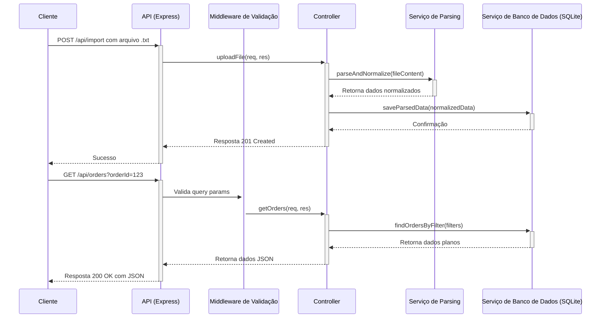
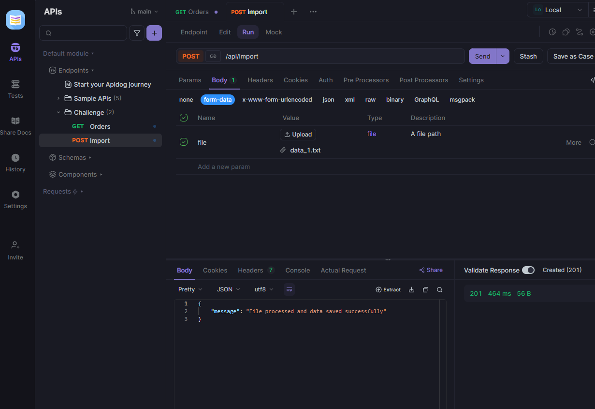
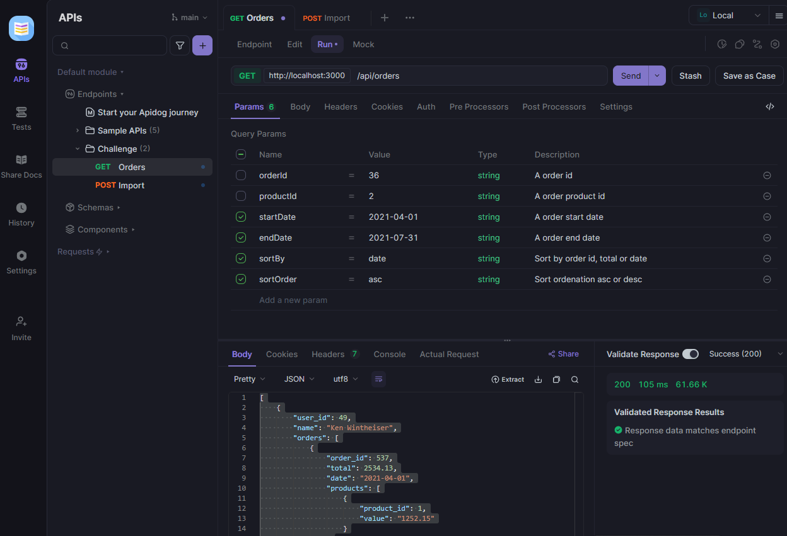

# Desafio Técnico - Vertical Logística

Esta é uma solução para o desafio técnico da Vertical Logística da LuizaLabs.

O projeto consiste em uma API REST que recebe um arquivo de texto com dados de pedidos, normaliza esses dados e os expõe em formato JSON, com funcionalidades de filtro.

## Tecnologias Utilizadas

- **Node.js:** Ambiente de execução para o servidor.
- **TypeScript:** Superset do JavaScript que adiciona tipagem estática.
- **Express:** Framework para a construção da API REST.
- **Multer:** Middleware para o upload de arquivos.
- **SQLite:** Banco de dados leve e embutido para persistência de dados.
- **Zod:** Biblioteca para validação de schema de dados.
- **Winston:** Biblioteca para logging estruturado.
- **Jest & Supertest:** Para os testes unitários e de integração.

## Justificativa das Escolhas Técnicas

Ao longo do desenvolvimento, priorizamos a **simplicidade** e a **lógica** como pilares, conforme destacado no desafio. As escolhas de ferramentas foram feitas para agregar valor sem introduzir complexidade desnecessária ou desviar o foco da lógica de negócio.

- **Express.js:** Escolhido por ser um framework web minimalista e flexível. Ele nos permite construir a API de forma eficiente, sem impor uma arquitetura rígida, mantendo o controle sobre o código da aplicação.

- **SQLite:** Para a persistência de dados, o SQLite foi a escolha ideal. Ele oferece um banco de dados relacional completo em um único arquivo, eliminando a necessidade de configurar e gerenciar um servidor de banco de dados externo (como PostgreSQL ou MySQL) ou Docker. Isso simplifica drasticamente o setup do ambiente de desenvolvimento e a execução da aplicação, alinhando-se perfeitamente com o requisito de simplicidade.

- **Zod:** Embora não seja um framework, o Zod é uma biblioteca poderosa para validação de schema. Sua inclusão justifica-se por:
    - **Clareza e Simplicidade:** Permite definir schemas de validação de forma declarativa e legível, tornando a validação de entradas da API muito mais simples e menos propensa a erros do que a validação manual.
    - **Segurança:** Garante que os dados recebidos pela API estejam no formato esperado, prevenindo bugs e vulnerabilidades.
    - **Manutenibilidade:** Separa a lógica de validação da lógica de negócio, aderindo ao princípio da Responsabilidade Única (SOLID), o que facilita a manutenção e a evolução do código.

- **Winston:** Para o logging, o Winston foi escolhido por ser uma biblioteca de logging robusta e flexível. Ele permite a criação de logs estruturados, o que é fundamental para a observabilidade da aplicação em ambientes de produção. Substituir `console.log` por um logger profissional melhora a capacidade de depuração e monitoramento, sem adicionar complexidade excessiva ao desenvolvimento.

## Escolhas Técnicas: Alternativas e Justificativas

| Componente/Funcionalidade | Tecnologia Escolhida | Justificativa da Escolha | Opções Alternativas | Por que a Alternativa Não Foi Escolhida (para este projeto) |
| :------------------------ | :------------------- | :----------------------- | :------------------ | :---------------------------------------------------------- |
| **Framework Web**         | Express.js           | Minimalista, flexível, amplamente adotado, permite foco na lógica central. | NestJS, módulo `http` nativo do Node.js | NestJS: Excesso para a simplicidade, mais opinativo. `http` nativo: Muito verboso, adiciona complexidade desnecessária para funcionalidades básicas de API. |
| **Persistência de Dados** | SQLite               | Simples, baseado em arquivo, não requer servidor externo, alinha-se com a simplicidade. | PostgreSQL, MySQL, MongoDB, Em memória (original) | DBs Externos: Adicionam complexidade de setup/gerenciamento (Docker/instalação). Em memória: Perda de dados ao reiniciar, não persistente. |
| **Validação de Entrada**  | Zod                  | Declarativo, com tipagem forte, separa a lógica de validação, melhora a robustez. | Validação manual, Joi, Yup | Manual: Verboso, propenso a erros, mistura responsabilidades. Outras libs: Similares ao Zod, mas Zod oferece excelente integração com TypeScript. |
| **Logging**               | Winston              | Logging estruturado, flexível, melhora a observabilidade. | `console.log` | `console.log`: Falta estrutura, difícil de filtrar/analisar em produção. |

## Arquitetura

A aplicação segue uma arquitetura em camadas, separando as responsabilidades de rota, controle e serviço, o que facilita a manutenção e o teste.

### Diagrama de Fluxo de Dados



### Diagrama de Componentes

```mermaid
graph TD
    subgraph "Cliente"
        C[Cliente via cURL/Frontend]
    end

    subgraph "Aplicação"
        A[Servidor Express] --> B{Rotas da API}
        B --> VM[Middleware de Validação]
        VM --> C1[Controller de Pedidos]
        C1 --> D[Serviço de Parsing]
        C1 --> DB[Serviço de Banco de Dados (SQLite)]
    end

    C --> A
```

## Como Executar

1.  **Instale as dependências:**
    ```bash
    npm install
    ```

2.  **Inicie o servidor:**
    ```bash
    npm start
    ```
    O servidor estará rodando em `http://localhost:3000`.

## Como Testar

Para rodar os testes unitários e de integração, execute:

```bash
npm test
```

Para gerar um relatório de cobertura de testes, execute:

```bash
npm run test:coverage
```

## Endpoints da API

### 1. Importar Arquivo

- **URL:** `/api/import`
- **Método:** `POST`
- **Formato:** `multipart/form-data`
- **Campo do arquivo:** `file`

**Exemplo de uso com cURL:**

```bash
# Substitua pelo caminho do seu arquivo
curl -X POST -F "file=@data/data_1.txt" http://localhost:3000/api/import
```

**Resultado da Execução:**



### 2. Consultar Pedidos

- **URL:** `/api/orders`
- **Método:** `GET`
- **Query Params (Opcionais):**
    - `orderId` (number): Filtra por um ID de pedido específico.
    - `startDate` (string - `YYYY-MM-DD`): Data de início do intervalo de filtro.
    - `endDate` (string - `YYYY-MM-DD`): Data de fim do intervalo de filtro.
    - `productId` (number): Filtra por um ID de produto específico.
    - `sortBy` (string - `order_id`, `total`, `date`): Ordena os resultados pelo campo especificado.
    - `sortOrder` (string - `asc`, `desc`): Ordena os resultados em ordem ascendente ou descendente.

**Exemplos de uso com cURL:**

- **Buscar todos os pedidos:**
  ```bash
  curl http://localhost:3000/api/orders
  ```

**Resultado da Execução:**



- **Buscar pelo ID do pedido:**
  ```bash
  curl http://localhost:3000/api/orders?orderId=753
  ```

- **Buscar por intervalo de datas:**
  ```bash
  curl http://localhost:3000/api/orders?startDate=2021-01-01&endDate=2021-03-31
  ```

- **Buscar por ID do produto:**
  ```bash
  curl http://localhost:3000/api/orders?productId=3
  ```

- **Buscar e ordenar por data ascendente:**
  ```bash
  curl http://localhost:3000/api/orders?sortBy=date&sortOrder=asc
  ```

- **Buscar e ordenar por total descendente:**
  ```bash
  curl http://localhost:3000/api/orders?sortBy=total&sortOrder=desc
  ```
